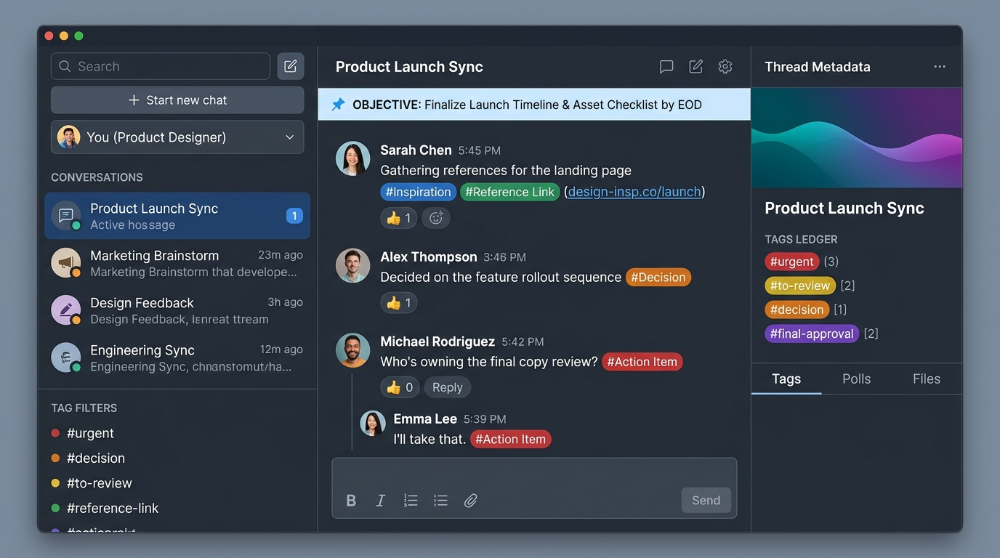

# ThreadFlow — Threads as a Project Management Single Source of Truth (SSOT)

[](https://threadflow-app-five.vercel.app/)
[](LICENSE)
[](https://threadflow-app-five.vercel.app/)
[](https://threadflow-app-five.vercel.app/)
[](https://threadflow-app-five.vercel.app/)

> **A Proof-of-Concept exploring how conversations, decisions, files, and tasks converge into a single unified workspace where threads serve as the ultimate Single Source of Truth (SSOT).**

🚀 **Live Interactive Demo:** [https://threadflow-app-five.vercel.app/](https://threadflow-app-five.vercel.app/)

---

## 🖥️ Workspace Preview



---

## 💡 The Vision Manifesto & Foundational Thesis

Modern knowledge workers and high-velocity teams spend their most critical hours communicating in chat, yet are constantly forced to bifurcate focus into external, heavyweight project management tools—issue trackers, sprint boards, disconnected wikis, and bureaucratic ticketing suites. 

This status-quo divide creates persistent organizational friction:
- **Cognitive & Context Fragmentation:** Critical discussions, code debates, and decision rationales remain trapped in chat histories, never reaching external tickets. Tickets become dry records devoid of the organic reasoning that formed them.
- **Documentation Drift & Wiki Decay:** Static documentation wikis rot the moment velocity increases, because updating external wikis requires manual, non-conversational administrative overhead.
- **Friction for the Chat-Native Generation:** High-velocity engineers, designers, and organizers resent tedious form-filling and bureaucratic status updates.

### The Hypothesized Paradigm
**ThreadFlow tests a fundamental hypothesis:**  
> **What if the thread itself IS the project management Single Source of Truth (SSOT)?**

Instead of treating chat as an ephemeral water-cooler and project management as a detached database destination, ThreadFlow elevates each thread into an autonomous, rich project workspace. Every conversation is simultaneously a real-time discussion, a living decision registry, an annotated design canvas, and an auditable workflow.

---

## ⚖️ The 6 Core Theses & How ThreadFlow Solves Them

| # | The Thesis / Friction Premise | The Underlying Problem | ThreadFlow's Proposed Solution | Architectural Execution |
|---|---|---|---|---|
| **1** | **Cognitive Bifurcation** | Workers lose 20–30% of their day switching between chat and external issue boards. | **Autonomous Thread Workspaces with Living Metadata** | Each thread is a self-contained project room with an editable title, mission description, and membership scope in one view. |
| **2** | **Documentation Drift** | Static wikis and Notion pages decay because documentation is detached from daily conversational flow. | **First-Class Tagging as a Living Documentation Instrument** | Inline tagging (`#decision`, `#spec`, `#blocker`, `#action-item`) transforms organic chat into an auditable, searchable knowledge base without leaving the stream. |
| **3** | **Goal Ambiguity & Pinboard Noise** | Channels accumulate dozens of uncurated pinned items, creating clutter instead of clarity. | **Strict 1-Pinned-Message North Star Rule** | Enforces exactly one pinned message per thread. Pinning a new item triggers an atomic replacement confirmation dialog comparing both candidates. |
| **4** | **Unresolved Debates & Consensus Loss** | "What did we decide?" debates drag on for hundreds of messages without recorded consensus. | **Interactive In-Stream Polls with Real-Time Consensus** | Squads launch interactive polls directly from the composer or sidebar. Live percentage bars and voter transparency record definitive team alignment in seconds. |
| **5** | **Detached Visual Asset Feedback** | Giving feedback on design mockups via text comments creates ambiguity and misinterpretation. | **Visual Pinpoint File Annotations** | Teammates drop numbered pins directly onto uploaded images/mockups. Each pin anchors an interactive subthread, resolving design feedback in place. |
| **6** | **Information Silos & Retrieval Friction** | Chat messages feel ephemeral and impossible to cite, while finding past decisions requires scrolling through noise. | **Permanent Deep Linking + Access Control & Fuzzy Search (`Cmd+K`)** | Every message is uniquely addressable via permalink with permission enforcement for private DMs, backed by global fuzzy search indexing rooms, authors, tags, polls, pins, and files. |

---

### Detailed Breakdown of Solutions

#### 1. Solving Cognitive Bifurcation: Living Thread Rooms
Traditional chat apps force teams into a two-tier hierarchy: chat channels for talking, and external trackers for status. In ThreadFlow:
- Any thread can be renamed, given an explicit mission statement, or repurposed dynamically with click-to-edit ease.
- The thread header, message stream, and metadata inspector form an integrated, single-screen workspace.
- Team members inspect active tags, polls, files, and members without leaving the conversation view.

#### 2. Solving Documentation Drift: Tagging as a Documentation Instrument (Not an Afterthought)
In conventional chat apps, tags are either non-existent or decorative badges. In ThreadFlow:
- **First-Class, Not an Afterthought:** Tagging is treated as a core architectural building block. It operates as an integrated documentation instrument embedded in the conversational flow.
- **Living Documentation & Audit Trails:** Tagging messages with `#decision`, `#spec`, `#blocker`, `#action-item`, `#feedback`, or custom domain tags records living project documentation without breaking collaboration momentum.
- **Thread-Scoped Governance & Descriptions:** Maintain clear team taxonomy with editable tag descriptions, color accents, and dedicated tag filters in the thread metadata sidebar.
- **Multi-Tag Querying & Synthesis:** Single-click or multi-select tag filtering instantly distills sprawling conversations down to high-signal deliverables and documentation summaries.
- **Single-Message Tag Uniqueness:** Thread admins can mark specific tags as *Unique* (e.g. `current-sprint-goal`), automatically enforcing that the tag exists on only one message at a time across the thread.

#### 3. Solving Goal Ambiguity: The 1-Pinned-Message North Star Constraint
Conventional chat apps allow users to pin unlimited messages, resulting in stale pinboards with 40 forgotten items. ThreadFlow enforces:
- **Exactly 1 Pinned Message per Thread:** At any given moment, a thread has one true North Star (the active spec, sprint goal, or critical blocker).
- **Atomic Replacement Modal:** Attempting to pin a new message presents a comparison dialog displaying the currently pinned message alongside the new candidate, preventing accidental overrides and keeping the team aligned on current priorities.
- **Sticky Pinned Banner:** The active pinned message remains anchored at the top of the message stream with instant jump-to-message navigation.

#### 4. Solving Consensus Loss: Interactive In-Stream Polls
Instead of open-ended conversational debates that fizzle out without conclusion:
- Launch single-choice or multi-choice polls directly from the message composer or metadata sidebar.
- Real-time percentage progress bars, voter counts, and toggle voting provide instant clarity.
- A dedicated **Polls Tab** in the sidebar lets team members inspect and vote on all active polls across the thread without getting lost in chat history.

#### 5. Solving Detached Asset Feedback: Visual Pinpoint File Annotations
Design iterations often suffer when feedback is provided as disconnected chat comments:
- Teammates upload mockups, diagrams, and screenshots directly into the thread.
- Dropping numbered pins onto specific coordinates anchors focused, in-context subthreads directly on the visual asset.
- Clicking any pinned annotation in the file preview jumps directly to the corresponding discussion subthread, and vice-versa.

#### 6. Solving Retrieval Friction: Deep Linking & Omni-Attribute Fuzzy Search
- **Permanent Deep Linking:** Every message has an anchor link with built-in permission verification, gracefully preventing unauthorized access to private DMs or restricted channels.
- **Omnipresent Fuzzy Search (`⌘K` / `Ctrl+K`):** Quickly filter and locate messages, rooms, teammates, polls, pinned messages, and file annotations with ranked relevance scoring and animated pulse navigation.

---

## 🎯 Target Culture & Audience

ThreadFlow is specifically tailored for teams, digital natives, and workflows that demand agility, clarity, and zero administrative friction:

1. **High-Velocity & Dynamic Squads:**
   - Product teams running fast design sprints and daily feature iterations.
   - Engineering incident war-rooms requiring immediate, auditable consensus logs.
   - Venture-backed startups and growth teams that move too fast for heavy ticketing suites.
2. **Chat-Native Workforce:**
   - Digital natives whose primary work rhythm is synchronous and async messaging (Slack, Discord, WhatsApp).
   - Zero onboarding friction, muscle-memory keyboard shortcuts (`Cmd+K`, `@mentions`, `Enter` to send), and immediate visual feedback.
3. **Beyond Work — Personal, Social & Community Coordination:**
   - **Personal Getting Things Done (GTD):** Private solo threads for daily logs, reading lists, habit tracking, and personal goals.
   - **Friends & Social Circles:** Vacation itineraries, group purchases, road trip logistics, and dinner polls with pinned logistics.
   - **Communities & DAOs:** Open-source coordination, volunteer initiatives, and transparent group governance.

---

## ⚡ Key MVP Features

1. **Threads as Living Projects** — Inline title & description editing, thread-level access permissions, and channel/DM categorization.
2. **1-Pinned-Message North Star Rule** — Strict single-pin limit with atomic replacement prompt and sticky banner navigation.
3. **First-Class Tagging Documentation Instrument** — Living documentation metadata, multi-tag filtering, tag descriptions, and single-message uniqueness constraints.
4. **Interactive In-Stream Polls** — Single & multi-vote options, real-time voter counts, percentage progress bars, and dedicated sidebar review tab.
5. **Visual Pinpoint File Annotations** — Numbered coordinate pins dropped directly on uploaded image assets with focused in-context subthreads.
6. **Deep Linking with Access Control** — Message permalinks with role-based permission verification for private channels and DMs.
7. **User @Mentions with Keyboard Autocomplete** — Suggestions trigger on `@` with arrow navigation, role chips, and broadcast tokens (`@channel`, `@here`).
8. **Omni-Attribute Fuzzy Search (`⌘K`)** — Relevance-scored search across rooms, users, messages, polls, pins, and files.
9. **Dark & Light Mode Harmony** — Comprehensive, eye-safe dark theme and crisp light theme with seamless real-time switching.

---

## 🛠️ Tech Stack & Architecture

- **Framework:** [Next.js 15+](https://nextjs.org/) (App Router, React 19)
- **Styling:** [Tailwind CSS v4](https://tailwindcss.com/)
- **Icons:** [Lucide React](https://lucide.dev/)
- **Animation:** `motion/react` & Tailwind transitions
- **Typography:** Refined typography scale with system fallbacks
- **State Management:** Reactive local state model with real-time UI synchronizations, deep link parsers, and fuzzy search indexing

---

## 🚀 Getting Started

Try the live application directly in your browser:
👉 **[https://threadflow-app-five.vercel.app/](https://threadflow-app-five.vercel.app/)**

### Local Setup Prerequisites
- Node.js 20+
- npm, pnpm, or bun

### Installation & Local Run

```bash
# 1. Install dependencies
npm install

# 2. Run the development server
npm run dev

# 3. Open your browser
# Navigate to http://localhost:3000
```

### Production Build

```bash
npm run build
npm run start
```

---

## 🗺️ MVP Roadmap & Proof-of-Concept Validation Goals

- [x] **Phase 1: Thread-as-SSOT Fundamentals** (Thread metadata, 1-pinned-message constraint, first-class tagging as documentation instrument, file annotations)
- [x] **Phase 2: Real-Time Flow & Consensus** (Interactive polls, user @mentions autocomplete, global fuzzy search, deep links)
- [ ] **Phase 3: Automated SSOT Synthesis** (AI-powered thread summaries, auto-extracting action items from pinned discussions)
- [ ] **Phase 4: Multi-User Collaboration & WebSockets** (Multiplayer typing presence, live cursor sync on file pins)
- [ ] **Phase 5: External Sync Adapters** (Optional bidirectional sync with Git commits, PR statuses, and external webhooks)

---

## 📄 Open Commercial License & Guided Intelligence Transparency

ThreadFlow is **100% open source and unconditionally commercial-use friendly**:
- **All Source Code, Schemas, & Adapters:** Licensed under the permissive **[MIT License](LICENSE)**.
- **Architectural Specs & Documentation:** Licensed under **[Creative Commons Attribution 4.0 (CC BY 4.0)](https://creativecommons.org/licenses/by/4.0/)**.
- **Commercial Rights:** Free to modify, self-host, embed, or monetize as SaaS or commercial software with zero royalties or proprietary restrictions.

### Guided Intelligence Transparency Disclosure
The application was engineered under the **Guided Intelligence Paradigm**—a transparent co-creation model pairing human domain direction (the human directing architect who conceived the "Thread as SSOT" thesis, non-negotiable invariants, and UX standards) with generative machine synthesis (code drafting, typing, and styling scaffolding).

For the full transparency breakdown detailing to what extent each factor was involved, see **[`LEGAL.md`](/LEGAL.md)** and Section 9 of **[`ARCHITECTURE_SPEC.md`](/ARCHITECTURE_SPEC.md)**.

